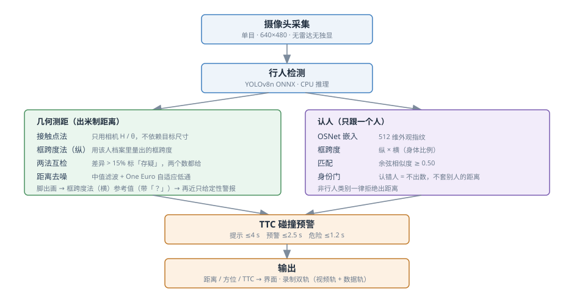
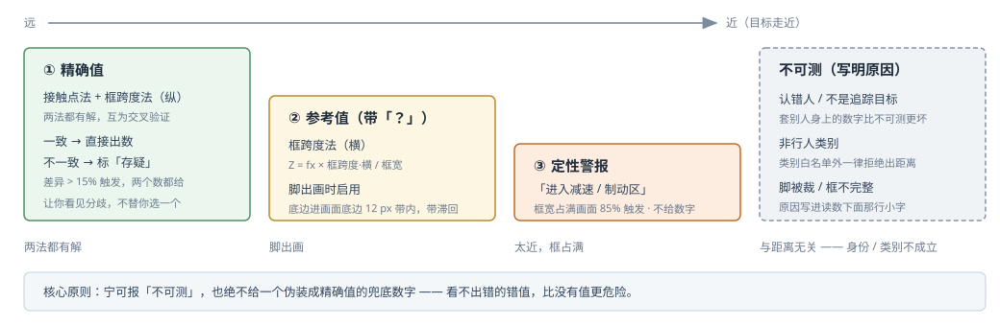
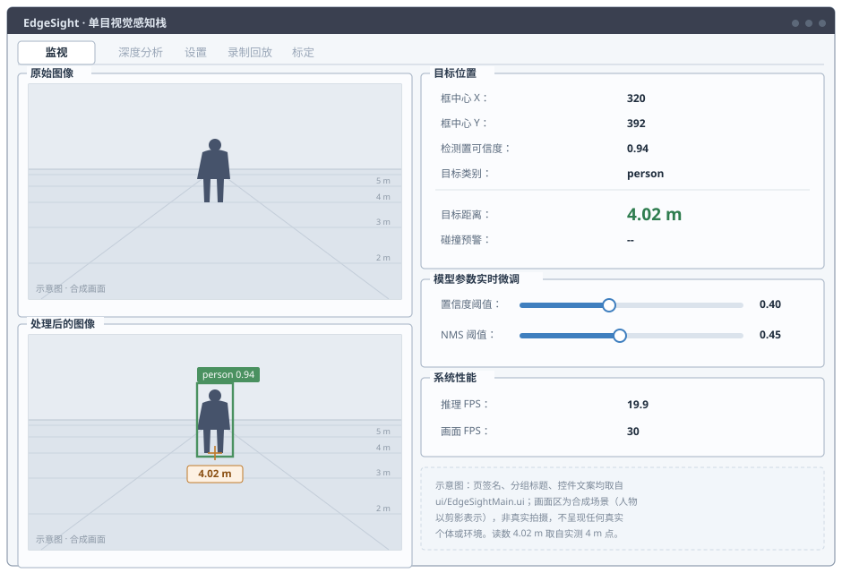
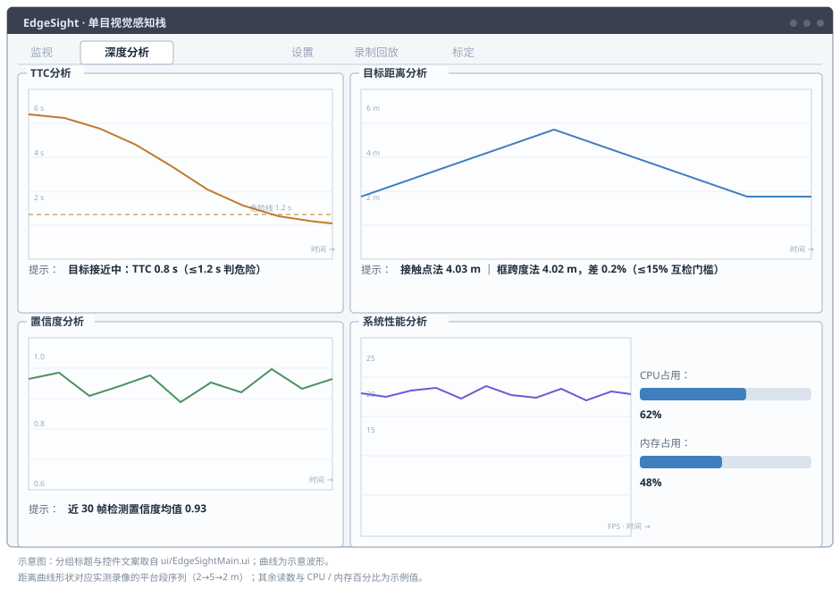
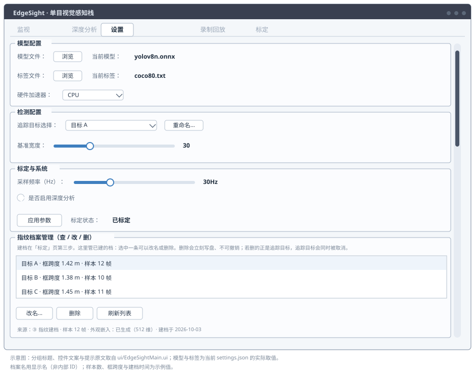
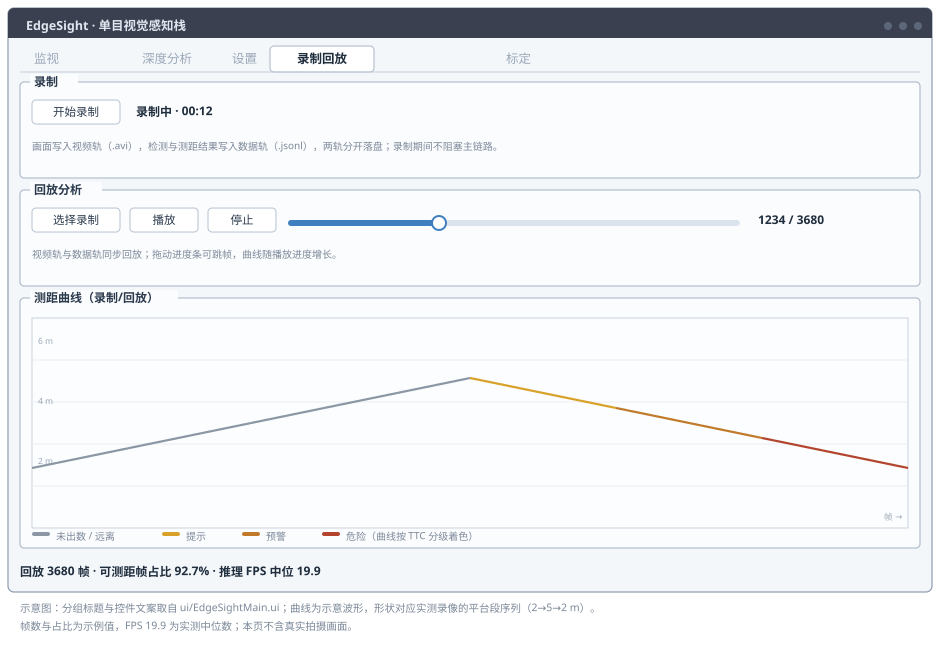
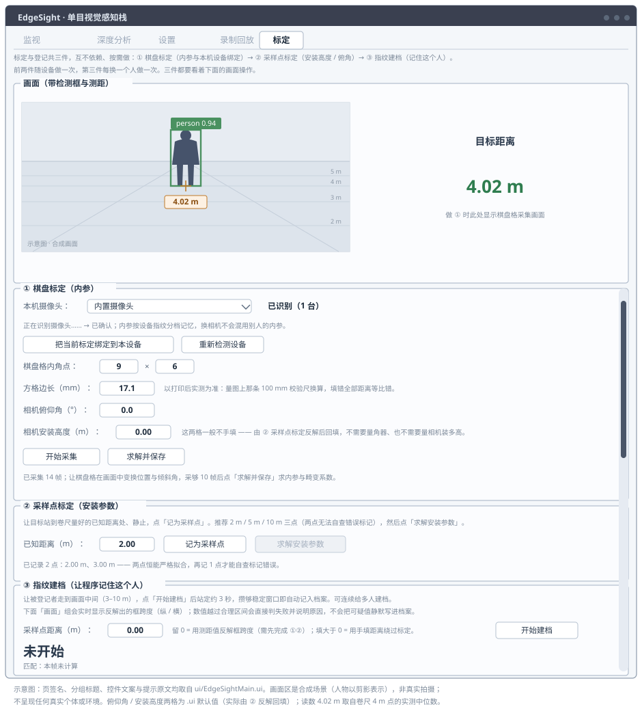
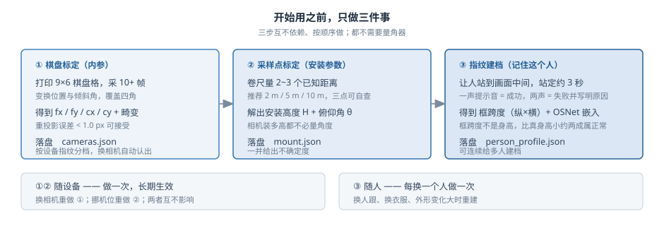

# EdgeSight

**跨平台单目视觉感知栈** —— 从摄像头画面里提取**行人的**空间信息（距离、方位、碰撞风险），
为自动驾驶决策层提供输入。支持 Windows 与树莓派 Linux，本期在 Windows PC 上交付。

**不含执行器，不做车辆控制 —— 它是一个纯粹的感知系统。**


> **当前状态**：开发重心在 Windows 端；树莓派端（`main_raspberry.py`）代码冻结、待移植。

---

## 它解决什么问题

我在东泉机器人实习做**农业无人车底盘**时撞上一个绕不开的问题：**超声波避障在农田杂草里
误触发严重** —— 草叶就是"障碍物"，车动不动就停。备选有两条：UWB 测距准，但要在地里布
基站，**成本农业场景吃不下来**；最后定的是**低成本单目视觉**。

回头看这个选择是被需求逼出来的：无人车真正需要的不是"有没有障碍物"，而是
「**离障碍物还有几米**」—— 而这正是单目图像 + 几何测距能回答的问题。那次实习只走到方案
评估，没把「从一张图像拿到米制距离」真正打通。EdgeSight 就是沿着这条线，在
**只有单目摄像头、没有激光雷达、没有独立显卡**的条件下，把
「检测 → 米制测距 → 碰撞风险预警」整条链路做出来，并**用卷尺实测误差**。

> 完整定位、成功判据与「明确不做」清单见 [`CHARTER.md`](CHARTER.md)。

---

## 主链路



检测之后分成两支：**几何测距**出米制距离，**认人**确认"这是不是要跟的那个人"。
两支的结果在身份门汇合 —— 认错人就不出数，因为**套在别人身上的距离看着正常、实际是
另一个人的**，比"不可测"更坏。

---

## 快速开始

```bash
git clone https://github.com/embed-lsy/EdgeSight.git
cd EdgeSight

# Windows
pip install PySide6 opencv-python numpy pyqtgraph psutil onnxruntime
python main_windows.py

# 树莓派 Linux（NCNN 需自行编译）
pip install PySide6 opencv-python numpy pyqtgraph psutil
python main_raspberry.py
```

跑起来后按「三步标定」走一遍（棋盘标定 → 采样点标定 → 指纹建档），
就能在监视页看到米制距离。**一步步照着做（配界面图）见
[`docs/操作指引.html`](docs/操作指引.html)**；纯文字简版见 [`docs/使用说明.md`](docs/使用说明.md)。

> **长时间挂机**：摄像头被系统挂起后 `VideoCapture` 会永久读不出帧（而 `isOpened()` 仍是
> True）。程序自带三层自愈 —— 掉线判定（连续 10 次失败才判）、自动重连（先 `release()`
> 再重开，指数退避）、检测心跳看门狗，另有投帧背压防延迟发散。**无需人工干预。**

---

## 核心能力

**米制测距，且知道什么时候该闭嘴。** 两种几何方法并行：**接触点法**（只用相机安装参数，
不依赖目标尺寸）与**框跨度法（纵）**（用该人档案里量出的框跨度）。两法互为交叉验证，
差异超过 **15%** 就标「存疑」并把两个数都给出来 —— 让你看见分歧，不替你选一个。



目标走近到脚出画时，依次降级为**框跨度法（横）参考值**（读数恒带「？」）与
**定性警报**（「进入减速/制动区」）。**绝不给伪装成精确值的兜底数字。**

**只跟一个人。** 特征指纹 = **框跨度（纵 × 横，其比值即身体比例）＋ OSNet 512 维外观嵌入**。
指定追踪目标后，本帧匹配到别人就当没这个人处理：不画框、不出距离、TTC 落回 `--`，
并把原因写进读数下面那行小字。

**TTC 碰撞预警。** 基于距离变化率估算碰撞时间并分级：提示 ≤4 s ／ 预警 ≤2.5 s ／ 危险 ≤1.2 s。
站定或远离不出数并说明原因，不拿噪声冒充风险。

**录制回放（双轨）。** 画面与检测/测距结果**分轨落盘**（视频轨 + 数据轨），不把检测框烧进
像素 —— 这样**回放可以用新参数重新解算旧数据**，这才是"事后分析"的意义。不依赖现场路况
即可反复调参与演示。

**换设备不用重新量角度。** 内参按**设备指纹**分档记忆（像蓝牙配对），换相机自动认出来、
没标定会提醒、分辨率不符直接拒用；安装高度与俯仰角由采样点标定反解，**不需要量角器，
也不需要量相机装了多高**。

---

## 界面一览

程序一共五个页签，分工是一条从「看结果」到「追原因」的链：**监视看现在 → 深度分析看刚才 →
设置配参数 → 录制回放存证据 → 标定做前提**。下面五张都是**界面示意图**（不是截图）：
页签名、分组标题、控件文案均取自 `ui/EdgeSightMain.ui`，画面区是**合成场景**，
不呈现任何真实个体与环境。

| 页面       | 干什么                                |
| -------- | ---------------------------------- |
| **监视**   | 实时画面 + 检测框 + 米制距离 + TTC；距离不可测时写明原因 |
| **深度分析** | TTC 曲线、距离曲线、置信度趋势、FPS 波动、CPU/内存占用  |
| **设置**   | 模型与推理引擎、追踪目标选择、指纹档案管理、运行参数         |
| **录制回放** | 开始录制 / 选择会话回放，曲线随进度增长并按 TTC 分级着色   |
| **标定**   | 三步：棋盘标定 → 采样点标定 → 指纹建档             |

### 监视



日常运行就盯这一页。左边两幅画面对照：**原始图像**是没有叠加的原帧，**处理后的图像**叠了
检测框、接触点十字与距离标签 —— 两幅并排是为了让你随时核对"框到底扣在人身上没有"。

右边「目标位置」出四个量：框中心像素、检测置信度、**米制距离**、**碰撞预警**。距离和 TTC
下面各有一行小字，**不可测时写明原因**（未标定 / 本帧没匹配到追踪目标 / 目标站定没有接近速度
/ 脚已出画），而不是留一个看着正常的假数字。下面「模型参数实时微调」两根滑杆调置信度
（默认 0.40）与 NMS（默认 0.45），**当场生效、不用重启**；「系统性能」分**推理 FPS** 与
**画面 FPS** 两个数，只有前者受模型影响 —— 掉帧时先看这两个的差值。

> 读数 `4.02 m` 取自卷尺 4 m 点的实测中位数。

### 深度分析



监视页只告诉你"现在几米"，这一页回答"刚才那几秒到底发生了什么"。四块曲线各有分工：
**TTC** 看接近过程是渐进还是突变（图里那条橙色虚线是 1.2 s 危险线）；**距离**看两法是否
出现分歧（持续张开的双线说明安装参数或档案有问题）；**置信度**看检测器有没有飘；
**系统性能**配右侧 CPU / 内存条看掉帧是算力不够还是别的原因。每块图下面那行「提示」是
**结论**（"两法差 0.2%"），不是图例。曲线默认不画 —— 要在设置页勾选「是否启用深度分析」并点
「应用参数」才开；且**只在停留于本页时才刷**，切走即停，不给主链路添负担。

### 设置



四组：**模型配置**换模型与标签文件、选硬件加速器（CPU / GPU / NPU，本期实测走 CPU）；
**检测配置**里的「追踪目标选择」是**单选**——一次只跟一个人，名字可以就地重命名；
**标定与系统**放采样频率、深度分析开关与**标定状态** —— 界面上改完要点「应用参数」才生效
（它会连同模型一起重新加载）；
**指纹档案管理**管已建的档：查、改名、删除。删除**立刻写盘、不可撤销**，
删掉的若正是当前追踪目标，追踪会同时被取消 —— 这个后果写在组里的提示行上，不是藏在文档里。

### 录制回放



上面录、下面放。**录制把视频轨与数据轨分开落盘**（画面 `.avi`、检测与测距结果 `.jsonl`），
录制期间不阻塞主链路。**回放两轨同步**，拖动进度条可跳帧，测距曲线随播放进度增长并
**按 TTC 分级着色**（灰 / 黄 / 橙 / 红 对应未出数、提示、预警、危险）。

关键在"分轨"：**检测框没有烧进像素**，所以回放可以用**新参数重新解算旧数据** ——
标定改了、阈值改了，同一段录像能重算一遍对比。这才是"事后分析"的意义，
也是本项目**不搭仿真**的底气：验证靠的是真实录像，不是合成场景。

### 标定



单目测距的前提在这一页，三件互不依赖、按需做，共用上方那块画面：

- **① 棋盘标定（内参）** —— 打印 9×6 棋盘格（图在
  [`docs/chessboard_A4_9x6_18mm.png`](docs/chessboard_A4_9x6_18mm.png)），采 10+ 帧求出
  `fx / fy / cx / cy` 与畸变系数。**方格边长以打印后量出来的为准**（填错这一格，全部距离等比错）。
  内参按**设备指纹**分档记忆，换相机不会混用别人的内参。
- **② 采样点标定（安装参数）** —— 让人站到卷尺量好的 2~3 个已知距离处各点一次「记为采样点」，
  程序反解出**安装高度 H 与俯仰角 θ** 并立即生效。**不用量角器，也不用量相机装了多高**；
  推荐三点，因为两点恒能严格拟合、查不出标记错误。
- **③ 指纹建档** —— 站定约 3 秒，记下这个人的框跨度与外观嵌入。
  **一声提示音 = 建档成功，两声 = 失败**（大字写出原因，数据不会入库）。可连续给多人建档。



标定页的画面**不做追踪**（有框就画），因为三步都要盯着画面确认目标完整入画；
监视页才是追踪口径。两页的差别是刻意的，不是 bug。

> 标几次、换相机重做什么、内参怎么按设备记忆 —— 详见 [`docs/标定与设备.md`](docs/标定与设备.md)。
> 相机装多高、俯仰角配多少 —— 详见 [`docs/相机怎么装.md`](docs/相机怎么装.md)。

---

## 实测表现

2026-10-03 在本机（ThinkBook 14 G6 / i5-13420H / 无独显 / 仅 CPU 推理）实测，
数据来自录像 `recordings/session-20261003-104548`：

| 判据             | 门槛                | 实测               | 判定    |
| -------------- | ----------------- | ---------------- | ----- |
| 实景测距（**≤5 m**） | 相对误差 ≤15%         | 7 个点，最大 **6.8%** | ✅     |
| 认出登记者          | ≥8/10（正面 / 背面各一轮） | **19 / 20**      | ✅     |
| 拒绝未登记者         | ≥9/10             | **9 / 10**（零余量）  | ⚠️ 踩线 |
| 推理帧率           | ≥15 FPS           | **19.96 FPS**    | ✅     |
| 录制回放           | 能录能回放             | 双轨落盘 + 回放        | ✅     |

⚠️ **范围限定**：可用场地最大只能铺到 5 m，且农业车跟随的目标本就在 5 m 内 ——
判据里「>5 m / ≤20%」那条分支**不适用且未验证**。
**对外报数必须带限定：「≤5 m 内达标，最大相对误差 6.8%」。**

> 验收测量协议（怎么量、记什么、合格线多少）见 [`EVALUATION.md`](EVALUATION.md)；
> 实测原始数据见 [`docs/验收实测.json`](docs/验收实测.json)。

---

## 平台与模型

| 平台        | 模型格式       | 推理引擎                      |
| --------- | ---------- | ------------------------- |
| Windows   | ONNX       | OpenCV DNN / ONNX Runtime |
| 树莓派 Linux | ONNX, NCNN | NCNN（优先）/ ONNX Runtime    |

本期实测 `yolov8n.onnx`（fp32）约 **21 FPS**（合成输入口径）。
FPS 实测细节与「三个 FPS 各指什么」见 [`docs/性能实测.md`](docs/性能实测.md)。

---

## 对标与边界

本项目刻意**对标开源社区同类项目**，而不是关起门来自己造：

| 项目                    | 借鉴方式      | 具体落地                    | 不跟随的部分                                                |
| --------------------- | --------- | ----------------------- | ----------------------------------------------------- |
| **Depth Anything V2** | ⚠️ 横评后不集成 | 用真实录像、112 个几何可信点离线横评米制版 | 中位误差 **57.9%** 且随距离漂移；根因是官方 `infer_image` **不接受相机内参** |
| **UniDepthV2**        | ⚠️ 横评后不集成 | 同一批点，按其接口喂真实内参 K        | 吃内参更好（去畸变后 25.2%），但近场最差（35.6%），CPU 仅 **0.65 FPS**     |
| **Supervision**       | ✅ 离线引入    | 用其 mAP / 混淆矩阵做离线评测口径    | **不进实时主链路**（主链路有 ≥15 FPS 硬指标）                         |
| **YOLOv8 / YOLO11**   | ✅ 主动横评    | 同一段录像上对比 FPS 与检测质量      | 不做训练 / 微调（无独显，只用预训练权重）                                |
| **YOLOPv2 / v3**      | ❌ 不采用     | 外推仅 1–2 FPS，距门槛差一个数量级   | 多任务输出（车道线等）不在范围内                                      |
| **openpilot**         | 📖 对标不跟随  | 借鉴其**感知输出契约与分层**思想      | 规划 / 控制 / 世界模型不在范围内（本项目不含执行器）                         |
| **Duckietown**        | 📖 对标不跟随  | 借鉴其**低成本可复现验证**方法论      | **不搭仿真** —— 用「录制回放」兑现同一目的                             |

> 深度测距这条路经横评后已**整体关闭**（从「范围内的」移入「明确不做」），
> 「双源互检」随之收正为**两法互检**（接触点法 ↔ 框跨度法）。

---

## 项目结构

```
EdgeSight/
├── core/
│   ├── calibration.py     # 相机标定、安装参数自标定、几何测距（接触点法 + 框跨度法）
│   ├── person_model.py    # 人员特征档案（框跨度 + 外观嵌入）+ 速度门控
│   ├── ttc.py             # TTC 碰撞预警
│   ├── camera_profiles.py # 内参档案库：按设备指纹分档记忆标定
│   ├── recorder.py        # 录制与回放（双轨：视频轨 + 数据轨）
│   ├── camera/            # 相机驱动与设备识别
│   ├── config/            # 平台参数配置
│   └── detector/          # 检测推理封装（ONNX Runtime / NCNN）
├── docs/
│   ├── assets/            # README 用示意图（架构 / 五个页面 / 三步标定 / 测距降级）
│   ├── 操作指引.html       # 「照着做」版验收流程
│   ├── 标定与设备.md       # 标几次、换相机重做什么
│   ├── 相机怎么装.md       # 安装高度 × 俯仰角选型
│   ├── 实现细节.md         # 功能特性的设计理由与实测依据
│   ├── 性能实测.md         # FPS 实测与线程数选型
│   ├── 验收实测.json       # 判据实测输入（闸门读它）
│   └── CHARTER-变更史.md
├── models/                # 模型与标定产物（设备相关，已 gitignore）
├── recordings/            # 录制产物（已 gitignore）
├── ui/                    # Qt UI 界面
├── main_windows.py        # Windows 入口
├── main_raspberry.py      # 树莓派入口（冻结，待移植）
└── charter_check.py       # CHARTER 闸门检查器（只读，判五条门槛）
```

## 文档索引

| 文档                                 | 回答什么问题                   |
| ---------------------------------- | ------------------------ |
| [`CHARTER.md`](CHARTER.md)         | 这个项目**是什么、不做什么**、凭什么算做成  |
| [`EVALUATION.md`](EVALUATION.md)   | 判据**怎么量、记什么、合格线多少**      |
| [`CONTEXT.md`](CONTEXT.md)         | 领域词汇表（框跨度 / 两法互检 / 降级……） |
| [`AGENTS.md`](AGENTS.md)           | 协作约定与开发纪律（开工前必读）         |
| [`docs/操作指引.html`](docs/操作指引.html) | 照着做：标定 → 测距 → 录制         |
| [`docs/使用说明.md`](docs/使用说明.md)     | 首次使用的完整八步                |
| [`docs/标定与设备.md`](docs/标定与设备.md)   | 部署要标几次、换相机重做什么           |
| [`docs/相机怎么装.md`](docs/相机怎么装.md)   | 装多高、俯仰角配多少               |
| [`docs/实现细节.md`](docs/实现细节.md)     | 每个功能**为什么这么设计**          |
| [`docs/性能实测.md`](docs/性能实测.md)     | FPS 怎么测的、三个 FPS 各指什么     |

## 贡献

欢迎提交 Issue 或 Pull Request 来改进 EdgeSight！

## 许可证

[MIT License](LICENSE)
