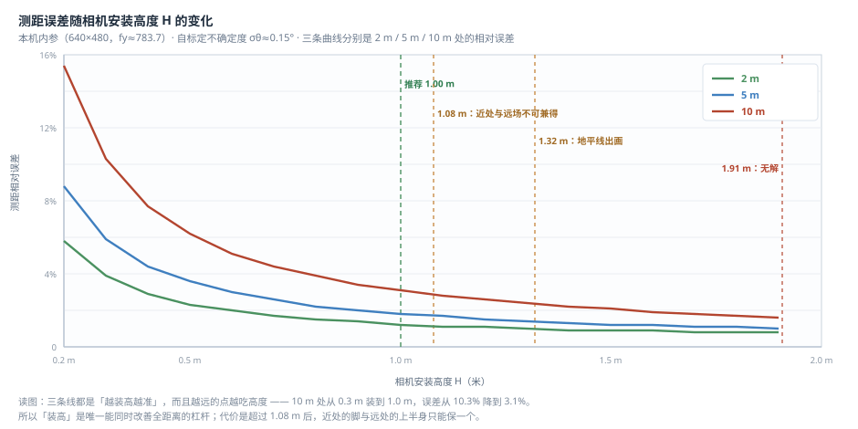
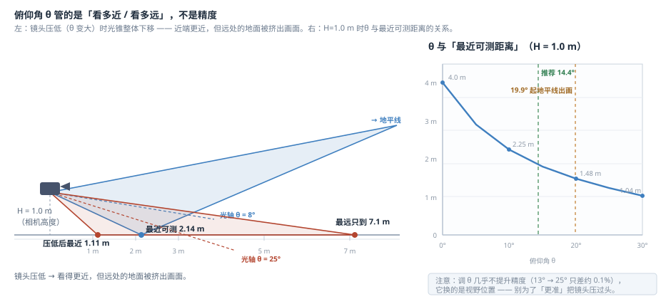

# 相机怎么装：安装高度 × 俯仰角

单目测距只依赖两个安装量：**相机装多高 `H`**、**朝下多少度 `θ`**。
这两个量互相牵制，装错了距离会成倍错。这一页讲清楚它们各自管什么、误差怎么变、
以及几组能直接照抄的值。

> 本文数字出自**本机实测标定**（`models/calib.json`：fx=772.8 / fy=783.7 / cx=305.7 /
> cy=283.9，画面 640×480，竖直视场 34°）。**换相机或改分辨率要按下面的公式重算**。
>
> **不想算？直接跳到最后一节**：程序能用「采样点标定」把 H 和 θ **自己解出来**，
> 你只需要让人在卷尺量好的 2~3 个距离上各站一次。

---

## 一、先定高度：装得越高越准



三条线都是单调下降的 —— **装高是唯一能同时改善全距离的杠杆**。以 10 m 处为例：
0.30 m 装高时误差 10.3%，装到 1.00 m 就降到 **3.1%**，再往上收益明显变平。

代价在 1.08 m 之后：装得越高，近处的脚越靠近画面下沿、远处的上半身越靠近上沿，
两者**开始抢同一块画面**（图里那条橙色虚线）。所以不是"越高越好"，
而是 **1.00 m 附近性价比最高**。

## 二、再定角度：θ 管的是视野，不是精度



这是最反直觉的一点：**俯仰角几乎不影响精度**（H=1.0 m 时，θ 从 13° 调到 25°
误差只差约 0.1%）。θ 真正决定的是**这块视野落在地面的哪一段**：

- **θ 调大（镜头压低）** → 看得更近，但远处的地面被挤出画面（地平线出画）；
- **θ 调小（镜头抬平）** → 远场完整，但近处的脚先掉出画面，测不到近处。

所以 θ 的取值原则只有一个：**取"刚够让 2 m 处的脚留在画面里"的最小角度，再留 3° 余量**。
不要为了"更准"把镜头压过头 —— 那丢的是整个远场。

---

## 三、公式（想自己算就代这几个）

三个误差来源，按方和根合成。**俯仰角项是主导项**：

| 来源 | 公式 | 特点 |
| --- | --- | --- |
| 俯仰角不准 `σθ` | 精确 `2·σθ / sin 2α`（σθ 取弧度）；心算 `≈ 1.745% × Z/H`（每 1°） | **与距离成正比、与高度成反比** ← 主导 |
| 脚点像素定位 `σpx` | `2 / (sin2α·(1+u²)·fy) × σpx` | 近处（大俯角）时很小 |
| 安装高度不准 `σH` | `σH / H` | 与 H 成反比 |

两个位置相关的量（α 是该距离处的俯角）：

```
俯角：      α(Z) = atan(H / Z)                    ← 只由 H 和 Z 决定，与 θ 无关
脚点行位置：v(Z) = cy + fy · tan(α(Z) − θ)         ← θ 只把这片视野整体上下挪
最近可测：  Z_最近 = H / tan(θ + 画面下半视场角)
            画面下半视场角 = atan((画面高 − cy) / fy) ≈ 14.0°（本机）
```

「最近可测」是现场最常撞上的问题：**比它更近就没有精确读数**，因为脚已经出画
（这是几何限制，不是模型或程序问题）。程序此时会降级为**参考值**（读数带 `？`）或
**定性警报**，不会编一个精确数字。

> **自标定的价值就在这里**：它把 `σθ` 从量角器的 ±0.5° 压到约 **±0.15°**。
> 因为误差 ∝ 1/H，这**相当于免费把相机装高了 3 倍** —— 这就是不推荐用卷尺加量角器硬量的原因。

---

## 四、照抄的表

**表 1｜三种预设（最佳值）** —— 高度能自己选时，从这三档里挑：

| 场景 | 安装高度 H | 俯仰角 θ | 2 / 5 / 10 m 误差 | 代价 |
| --- | --- | --- | --- | --- |
| ① 不想量角度（摆平就行） | **0.45 m** | **0°** | 2.6% / 3.9% / 6.9% | 精度一般 |
| ② **均衡（推荐）** | **1.00 m** | **14.4°** | 1.2% / 1.8% / **3.1%** | **无** |
| ③ 精度极限 | **1.85 m** | **29.9°** | 0.8% / 1.0% / 1.7% | 丢掉整个远场，两法互检不可用 |

**表 2｜常见高度的推荐俯仰角（经典值）** —— 高度被车体定死时，用它查该配多少度：

| H (m) | 0.30 | 0.50 | 0.70 | 0.90 | **1.00** | 1.20 | 1.50 |
| --- | --- | --- | --- | --- | --- | --- | --- |
| **推荐 θ** | −2.0° | 3.5° | 8.8° | 13.8° | **14.4°** | 19.9° | 26.4° |
| 10 m 误差 | 10.3% | 6.2% | 4.4% | 3.4% | **3.1%** | 2.6% | 2.1% |
| 备注 | 太低 | | 保险杠常见 | | 什么都不丢 | 10 m 只剩半身 | 地面只到 13 m |

表 2 里没有你的高度，用这条式子算（本机内参，H ≤ 0.9 m 适用）：

```
θ ≈ atan(H / 2) − 10.5°
```

---

## 五、四个临界高度（越过就要做取舍）

| 临界值 | 越过之后 |
| --- | --- |
| H < **0.17 m** | 10 m 处俯角 < 1°，`Z = H/tan α` 发散，**接触点法本身失效** |
| H > **1.08 m** | 「2 m 的脚入画」与「10 m 的全身入画」**不可兼得** |
| H > **1.32 m** | 地平线出画，画面里的地面缩到有限远处 |
| H > **1.91 m** | 无解 —— 2 m 的脚怎么调 θ 都进不来 |

两条规则：**先看 H 是不是你能选的**（能选就在 1.08 m 以内尽量装高），
**再按上面的原则定 θ**。

> 「全身可见」只对 10 m 成立：俯仰角越大，越近的目标头顶越会被画面上沿裁掉
> （1.00 m 装、14.4° 时，7.3 m 以内的人头顶就不在画面里了）。
> 头顶被裁**不影响接触点法出数**（它只用框底边），但近处的框跨度法与两法互检不成立。

---

## 六、不想手算：让程序解

在「标定」页 **② 组「采样点标定（安装参数）」**：把人摆到卷尺量好的
**2 m / 5 m / 10 m** 三个点，各点一次「记为采样点」，再点「求解安装参数」——
程序同时解出 **H 与 θ** 并立即写回，还会给出不确定度（例如 `±0.5 cm / ±0.08°`）。

这一步真正的作用不只是省事：**它能验掉"实际装的高度/角度和你想装的不一样"**
（车体变形、支架歪斜都会偏），而这恰恰是手算表查不出来的。

> 为什么推荐三点：两点标定的方程有**两个同样吻合的解**（"低装+小平角"与"高装+大俯角"），
> 且两点**恒能严格拟合**，所以查不出"把膝盖当成脚"这类标记错误；三点有冗余，能靠残差自查。

> 标几次、换相机要重做什么 —— 详见 [`标定与设备.md`](标定与设备.md)。
